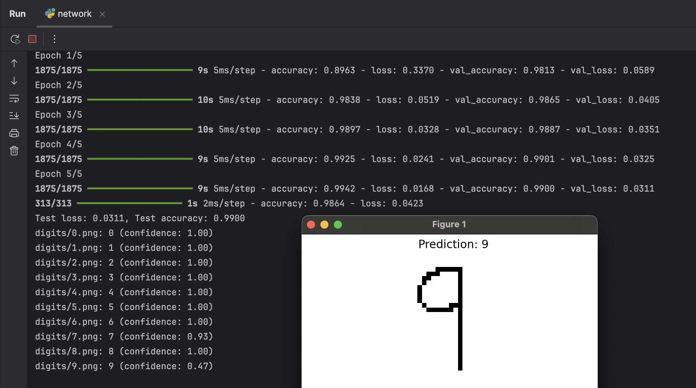

# MNIST Digit Recognizer with Custom Image Prediction

This project trains a Convolutional Neural Network (CNN) using the MNIST dataset and allows you to predict handwritten 
digits from custom `.png` images stored locally. It's designed to help you understand image preprocessing, model training, 
and practical deployment of a digit recognition model.

## Example



## Features

- Clean and modular Python code using best practices
- CNN architecture for improved accuracy over dense-only models
- Predicts digits from your own `digits/` folder
- Shows prediction confidence and displays the image
- Saves and reloads model with Keras

---

## Model Architecture

```text
Input: 28x28 grayscale image
↓
Conv2D → ReLU → MaxPool
↓
Conv2D → ReLU → MaxPool
↓
Flatten → Dense → Dense(10)
↓
Softmax output (0–9)
